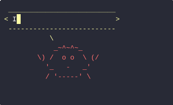

<!-- GitHub Profile README -->

<h1 align="center">Hey there 👋  I'm Eddie Groh</h1>

Data & AI grad · Rust / C++ / Python developer · Autonomous‑systems tinkerer

---

### 🚀 What I do
- 🎓 **M.Sc. Data & Artificial Intelligence** — double‑degree @ Institut Polytechnique de Paris & TUM
- 🚗 **Prototype autonomous vehicles** — end‑to‑end software &amp; systems integration for on‑road and competition platforms
- 🔬 Past research in **optimisation &amp; distributed systems** (IEEE ETFA 2023 paper)

---

### 🛠️ Tech I enjoy

  
  
  
  
  
  
  
  

  
Ferris fortune 🦀 (click to hide)

  

    
  

---

### 📈 GitHub Stats

  
  &nbsp;&nbsp;
  

